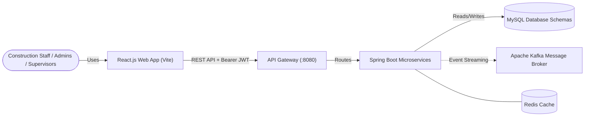
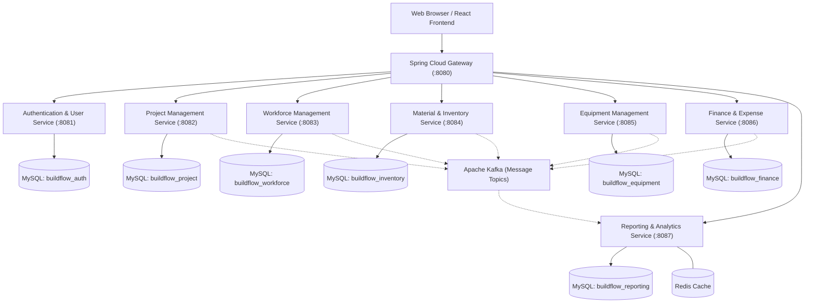
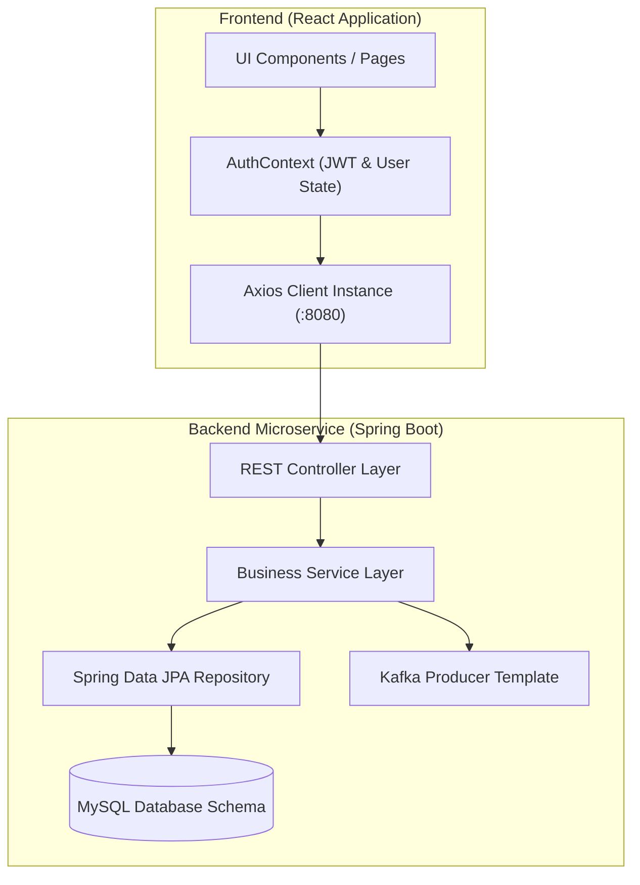
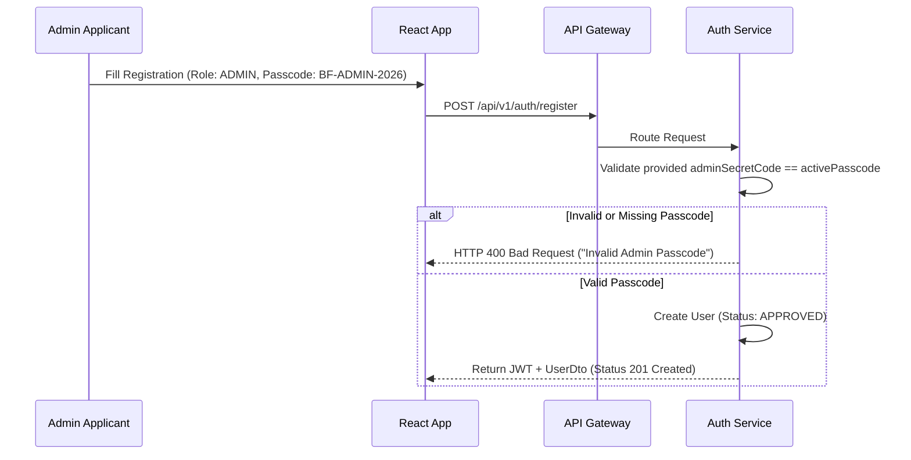
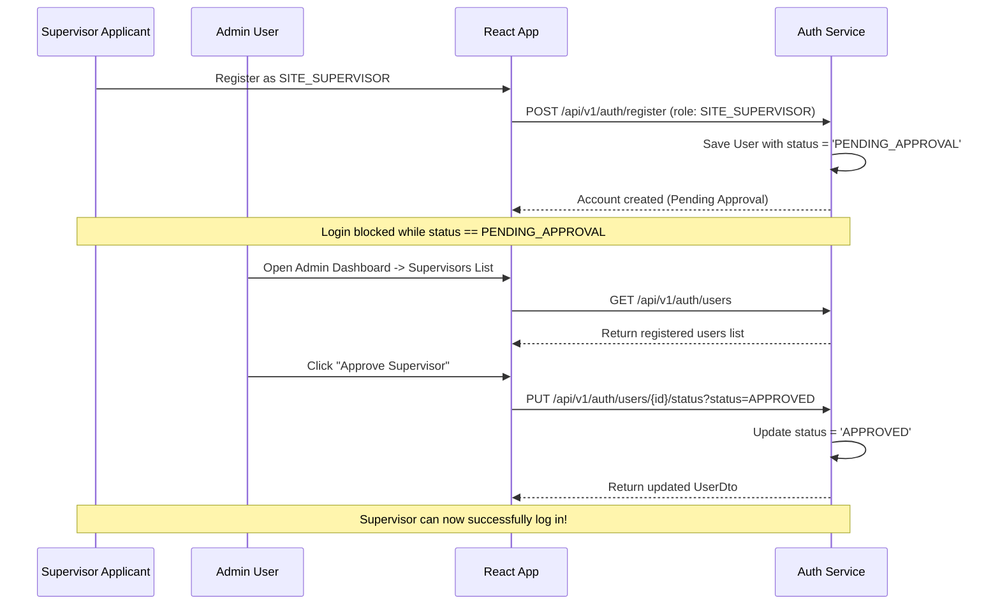
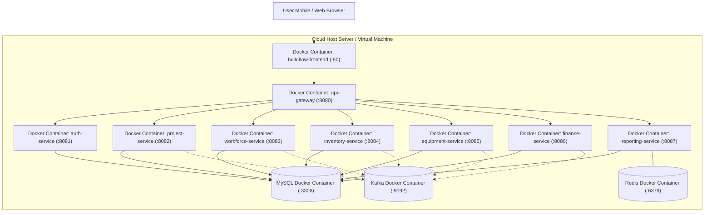

# Architecture Document

## High Level Architecture
BuildFlow utilizes a Microservices Architecture to ensure scalability, fault isolation, and independent deployments. 

The platform consists of a single-page application (React.js + Vite) communicating via REST APIs through an API Gateway (`port 8080`) with multiple Spring Boot microservices. Each microservice manages its own isolated MySQL database schema (Database-per-Service pattern). Asynchronous event-driven communication is handled by Apache Kafka to decouple services, and Redis is used for caching aggregated analytics data to ensure rapid dashboard load times.

## Microservice Diagram

## Component Diagram

## Service Responsibilities
- **API Gateway (8080):** Single entry point for frontend traffic. Handles routing, rate limiting, and global CORS configuration.
- **Authentication & User Service (8081):** Manages user authentication, JWT generation, Company Admin Access Passcode verification (`BF-ADMIN-2026`), Site Supervisor status approval (`APPROVED`, `PENDING_APPROVAL`, `REJECTED`), and user management endpoints.
- **Project Management Service (8082):** Manages project lifecycles (`PLANNED`, `ACTIVE`, `COMPLETED`, `CANCELLED`), project details, location logs, and estimated budgets.
- **Workforce Management Service (8083):** Onboards labourers (Daily, Fixed Work, Monthly), records daily attendance, calculates wages, manages supervisor allocations, and handles wage payments.
- **Material & Inventory Service (8084):** Dynamic material catalog management, company stock-in (`projectId = 0`), project stock consumption at Weighted Average Cost (WAC), and low-stock threshold monitoring.
- **Equipment Management Service (8085):** Equipment asset registry, project allocations, usage logging (`HOURLY` / `DAILY` costing rates), fuel logs, and maintenance tracking.
- **Finance & Expense Service (8086):** Consolidates expenses (`WORKFORCE`, `MATERIAL`, `EQUIPMENT`, `MISC`), maintains payment ledger, tracks outstanding balances, and calculates profit/loss.
- **Reporting & Analytics Service (8087):** Consumes Kafka events to build materialized views in Redis for dashboard analytics.

## Authentication & Security Passcode Sequence Flow

### 1. Admin Registration with Company Passcode Flow

### 2. Supervisor Registration & Admin Approval Sequence Flow

## Deployment Diagram

