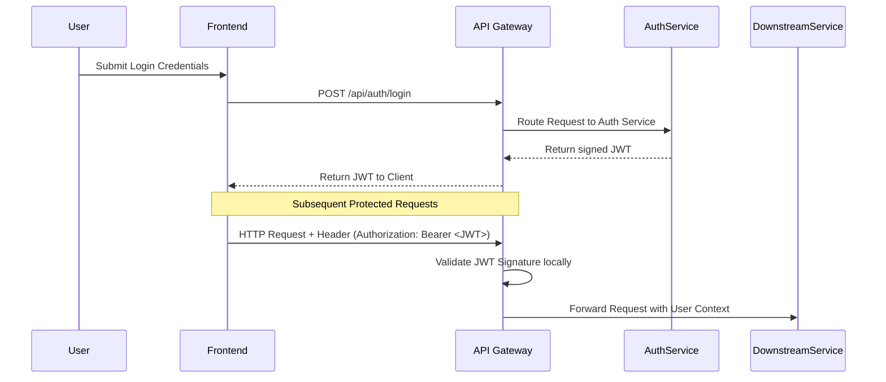
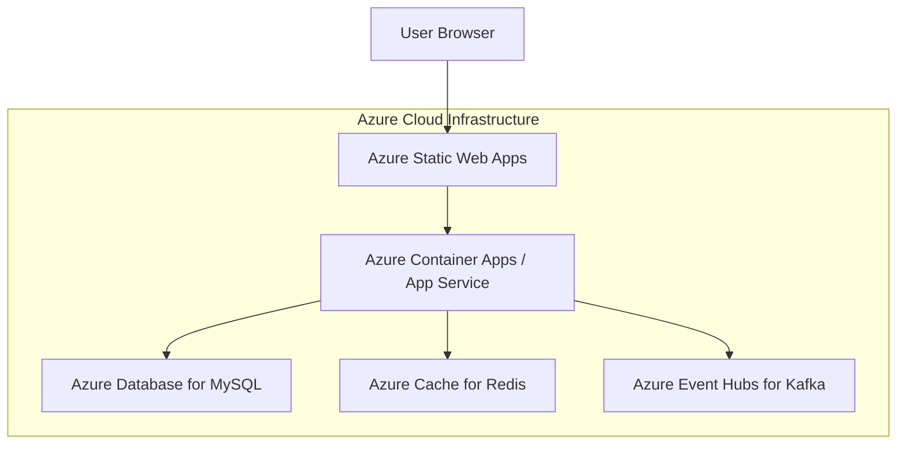

# Architecture Document

## High Level Architecture
BuildFlow utilizes a Microservices Architecture to ensure scalability, fault isolation, and independent deployments. 

The platform consists of a single-page application (React.js) communicating via REST APIs with multiple Spring Boot microservices. Each microservice manages its own database (Database-per-Service pattern using MySQL). Asynchronous event-driven communication is handled by Apache Kafka to decouple services, and Redis is used for caching aggregated analytics data to ensure fast dashboard load times.

## Microservice Diagram
```mermaid
graph TD
    Client[Web Browser / React Frontend] --> APIGateway[Spring Cloud Gateway]
    
    APIGateway --> AuthService[Authentication & User Service]
    APIGateway --> ProjService[Project Management Service]
    APIGateway --> WorkService[Workforce Management Service]
    APIGateway --> InvService[Material & Inventory Service]
    APIGateway --> EquipService[Equipment Management Service]
    APIGateway --> FinService[Finance & Expense Service]
    APIGateway --> RepService[Reporting & Analytics Service]
    
    AuthService --> DBAuth[(MySQL: Auth)]
    ProjService --> DBProj[(MySQL: Project)]
    WorkService --> DBWork[(MySQL: Workforce)]
    InvService --> DBInv[(MySQL: Inventory)]
    EquipService --> DBEquip[(MySQL: Equipment)]
    FinService --> DBFin[(MySQL: Finance)]
    RepService --> DBRep[(MySQL: Reporting)]

    %% Event-Driven Data Flow
    ProjService -.-> Kafka[Apache Kafka (Message Broker)]
    WorkService -.-> Kafka
    InvService -.-> Kafka
    FinService -.-> Kafka
    
    Kafka -.-> NotifService[Notification Service]
    Kafka -.-> RepService
    
    %% Caching Layer
    RepService --- Redis[(Redis Cache)]
```

## Component Diagram
```mermaid
graph TD
    subgraph Frontend (React Application)
        UI[UI Components / Pages] --> Redux[State Management / Context]
        Redux --> Axios[Axios HTTP Client]
    end
    
    subgraph Backend Microservice (Spring Boot)
        Controller[REST Controller Layer] --> Service[Business Service Layer]
        Service --> Repository[Spring Data JPA Repository]
        Repository --> DB[(MySQL Database)]
        Service --> KafkaProducer[Kafka Producer Template]
    end
    
    Axios --> Controller
```

## Service Responsibilities
- **API Gateway:** Acts as the single entry point. Handles routing, rate limiting, and global CORS configuration.
- **Authentication & User Service:** Handles user registration, JWT generation, token validation, and Role-Based Access Control (RBAC).
- **Project Management Service:** Manages project lifecycles, project details, status tracking, and budget definition.
- **Workforce Management Service:** Manages labourer profiles, logs daily attendance, and calculates daily wages and supervisor salaries.
- **Material & Inventory Service:** Maintains the material catalog, handles inward/outward stock, tracks material consumption, and calculates current stock.
- **Equipment Management Service:** Maintains the equipment registry, handles project allocation, logs fuel expenses, and schedules maintenance.
- **Finance & Expense Service:** Aggregates costs from other services, tracks miscellaneous expenses, and calculates project-wise profit/loss.
- **Notification Service:** Listens to Kafka topics (e.g., low stock alerts) and dispatches in-app or email notifications.
- **Reporting & Analytics Service:** Consumes Kafka events to build materialized views in Redis, powering the real-time Business Analytics Dashboard.

## Authentication Flow


## Deployment Diagram

