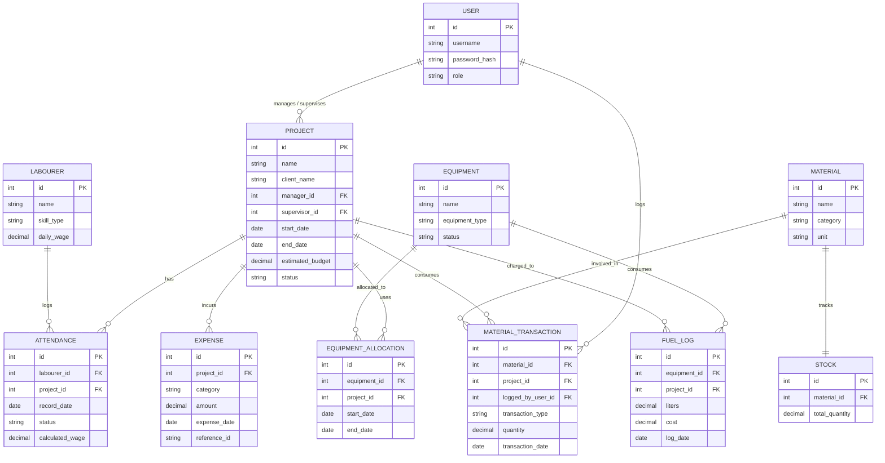

# Database Design Document

## ER Diagram
BuildFlow utilizes a Database-per-Service architecture. The logical relationships between the distributed entities are visualized below. Notice that `USER` is logically connected to `PROJECT` to represent assignments (Managers and Supervisors).



## MySQL Schema
Since this is a microservices architecture, the tables below represent schema definitions across multiple isolated databases.

```sql
-- Auth Service Database
CREATE TABLE users (
    id INT AUTO_INCREMENT PRIMARY KEY,
    username VARCHAR(50) NOT NULL UNIQUE,
    password_hash VARCHAR(255) NOT NULL,
    role VARCHAR(20) NOT NULL,
    created_at TIMESTAMP DEFAULT CURRENT_TIMESTAMP
);

-- Project Service Database
CREATE TABLE projects (
    id INT AUTO_INCREMENT PRIMARY KEY,
    name VARCHAR(100) NOT NULL,
    client_name VARCHAR(100) NOT NULL,
    manager_id INT,    -- Logical FK to users.id
    supervisor_id INT, -- Logical FK to users.id
    start_date DATE,
    end_date DATE,
    estimated_budget DECIMAL(15, 2) NOT NULL,
    status VARCHAR(20) DEFAULT 'ACTIVE'
);

-- Workforce Service Database
CREATE TABLE labourers (
    id INT AUTO_INCREMENT PRIMARY KEY,
    name VARCHAR(100) NOT NULL,
    skill_type VARCHAR(50) NOT NULL,
    daily_wage DECIMAL(10, 2) NOT NULL
);

CREATE TABLE attendance (
    id INT AUTO_INCREMENT PRIMARY KEY,
    labourer_id INT NOT NULL, -- Logical FK to labourers.id
    project_id INT NOT NULL,  -- Logical FK to projects.id
    record_date DATE NOT NULL,
    status VARCHAR(20) NOT NULL,
    calculated_wage DECIMAL(10, 2) NOT NULL
);

-- Inventory Service Database
CREATE TABLE materials (
    id INT AUTO_INCREMENT PRIMARY KEY,
    name VARCHAR(100) NOT NULL,
    category VARCHAR(50) NOT NULL,
    unit VARCHAR(20) NOT NULL
);

CREATE TABLE stock (
    id INT AUTO_INCREMENT PRIMARY KEY,
    material_id INT NOT NULL UNIQUE, -- Logical FK to materials.id
    total_quantity DECIMAL(15, 2) NOT NULL DEFAULT 0.00
);

CREATE TABLE material_transactions (
    id INT AUTO_INCREMENT PRIMARY KEY,
    material_id INT NOT NULL, -- Logical FK to materials.id
    project_id INT NOT NULL,  -- Logical FK to projects.id
    logged_by_user_id INT,    -- Logical FK to users.id
    transaction_type VARCHAR(10) NOT NULL, -- 'IN' or 'OUT'
    quantity DECIMAL(15, 2) NOT NULL,
    transaction_date DATE NOT NULL
);

-- Equipment Service Database
CREATE TABLE equipment (
    id INT AUTO_INCREMENT PRIMARY KEY,
    name VARCHAR(100) NOT NULL,
    equipment_type VARCHAR(50) NOT NULL,
    status VARCHAR(20) DEFAULT 'ACTIVE'
);

CREATE TABLE equipment_allocations (
    id INT AUTO_INCREMENT PRIMARY KEY,
    equipment_id INT NOT NULL, -- Logical FK to equipment.id
    project_id INT NOT NULL,   -- Logical FK to projects.id
    start_date DATE NOT NULL,
    end_date DATE
);

CREATE TABLE fuel_logs (
    id INT AUTO_INCREMENT PRIMARY KEY,
    equipment_id INT NOT NULL, -- Logical FK to equipment.id
    project_id INT NOT NULL,   -- Logical FK to projects.id
    liters DECIMAL(10, 2) NOT NULL,
    cost DECIMAL(10, 2) NOT NULL,
    log_date DATE NOT NULL
);

-- Finance Service Database
CREATE TABLE expenses (
    id INT AUTO_INCREMENT PRIMARY KEY,
    project_id INT NOT NULL, -- Logical FK to projects.id
    category VARCHAR(50) NOT NULL, -- 'LABOUR', 'MATERIAL', 'EQUIPMENT', 'MISC'
    amount DECIMAL(15, 2) NOT NULL,
    expense_date DATE NOT NULL,
    reference_id VARCHAR(100) -- Soft link to source transaction ID
);
```

## Mongo Collections
**Status: Not Applicable.**
*BuildFlow uses a purely relational data model distributed across MySQL databases. No NoSQL MongoDB collections are required for the current scope.*

## Relationships
Even though databases are isolated per microservice, logical relationships exist via ID referencing:
- **One-to-Many:** One `User` manages/supervises many `Projects`.
- **One-to-Many:** One `Project` has many `Attendance` records.
- **One-to-Many:** One `Project` has many `Material_Transactions`.
- **One-to-Many:** One `Project` has many `Expenses`.
- **One-to-One:** One `Material` has exactly one aggregate `Stock` record.

## Constraints
- **Primary Keys:** Every table strictly uses an auto-incremented integer `id` as the Primary Key.
- **Foreign Keys:** While true DB-level Foreign Keys are used within the same microservice (e.g., `attendance.labourer_id -> labourers.id`), cross-service relationships (e.g., `attendance.project_id -> projects.id`) are maintained logically at the application level.
- **Unique Constraints:** `users.username` and `stock.material_id` must be unique.
- **Not Null Constraints:** Critical fields like wages, amounts, and statuses cannot be null.

## Indexes
To ensure fast query performance and dashboard aggregations, the following indexes will be created:
- `idx_users_username` on `users(username)` for fast login lookups.
- `idx_projects_manager` on `projects(manager_id, supervisor_id)` for quick role-based project filtering.
- `idx_attendance_project_date` on `attendance(project_id, record_date)` for fast workforce cost aggregations.
- `idx_expenses_project` on `expenses(project_id)` to quickly calculate project profitability.
- `idx_transactions_project` on `material_transactions(project_id)` for quick consumption reporting.
