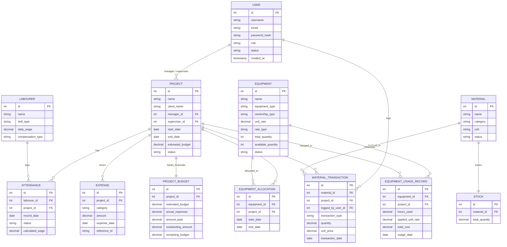

# Database Design Document

## ER Diagram
BuildFlow utilizes a Database-per-Service architecture. The logical relationships between distributed entities across microservice schemas are visualized below. Notice that `USER` (in `buildflow_auth`) logically references `PROJECT` assignments, `MATERIAL_TRANSACTIONS`, and supervisor registrations.



## MySQL Schema Definition Across Microservice Databases

```sql
-- 1. Auth Service Database (buildflow_auth)
CREATE TABLE users (
    id BIGINT AUTO_INCREMENT PRIMARY KEY,
    username VARCHAR(50) NOT NULL UNIQUE,
    email VARCHAR(100) NOT NULL UNIQUE,
    password VARCHAR(255) NOT NULL,
    role VARCHAR(30) NOT NULL,
    status VARCHAR(30) DEFAULT 'APPROVED', -- 'APPROVED', 'PENDING_APPROVAL', 'REJECTED'
    created_at TIMESTAMP DEFAULT CURRENT_TIMESTAMP
);

-- 2. Project Service Database (buildflow_project)
CREATE TABLE projects (
    id BIGINT AUTO_INCREMENT PRIMARY KEY,
    project_name VARCHAR(100) NOT NULL,
    client_name VARCHAR(100) NOT NULL,
    location VARCHAR(255),
    manager_id BIGINT,
    supervisor_id BIGINT,
    start_date DATE,
    end_date DATE,
    estimated_budget DECIMAL(15, 2) NOT NULL,
    status VARCHAR(20) DEFAULT 'PLANNED' -- 'PLANNED', 'ACTIVE', 'COMPLETED', 'CANCELLED'
);

-- 3. Workforce Service Database (buildflow_workforce)
CREATE TABLE labourers (
    id BIGINT AUTO_INCREMENT PRIMARY KEY,
    name VARCHAR(100) NOT NULL,
    phone_number VARCHAR(20),
    skill_type VARCHAR(50) NOT NULL,
    compensation_type VARCHAR(30) DEFAULT 'DAILY', -- 'DAILY', 'FIXED_WORK', 'MONTHLY'
    daily_wage DECIMAL(10, 2) NOT NULL
);

CREATE TABLE attendance (
    id BIGINT AUTO_INCREMENT PRIMARY KEY,
    labourer_id BIGINT NOT NULL,
    project_id BIGINT NOT NULL,
    record_date DATE NOT NULL,
    status VARCHAR(20) NOT NULL, -- 'PRESENT', 'ABSENT', 'HALF_DAY'
    calculated_wage DECIMAL(10, 2) NOT NULL
);

-- 4. Inventory Service Database (buildflow_inventory)
CREATE TABLE materials (
    id BIGINT AUTO_INCREMENT PRIMARY KEY,
    name VARCHAR(100) NOT NULL,
    category VARCHAR(50) NOT NULL, -- 'CEMENT', 'STEEL', 'PAINT', 'SAND', 'AGGREGATE', etc.
    unit VARCHAR(20) NOT NULL,
    status VARCHAR(20) DEFAULT 'ACTIVE'
);

CREATE TABLE stock (
    id BIGINT AUTO_INCREMENT PRIMARY KEY,
    material_id BIGINT NOT NULL UNIQUE,
    total_quantity DECIMAL(15, 2) NOT NULL DEFAULT 0.00
);

CREATE TABLE material_transactions (
    id BIGINT AUTO_INCREMENT PRIMARY KEY,
    material_id BIGINT NOT NULL,
    project_id BIGINT NOT NULL, -- '0' represents Company Stock-In
    logged_by_user_id BIGINT,
    transaction_type VARCHAR(10) NOT NULL, -- 'IN' or 'OUT'
    quantity DECIMAL(15, 2) NOT NULL,
    unit_price DECIMAL(10, 2),
    transaction_date DATE NOT NULL
);

-- 5. Equipment Service Database (buildflow_equipment)
CREATE TABLE equipment (
    id BIGINT AUTO_INCREMENT PRIMARY KEY,
    name VARCHAR(100) NOT NULL,
    equipment_type VARCHAR(50) NOT NULL, -- 'HEAVY_MACHINERY', 'VEHICLES', 'LIGHT_EQUIPMENT', etc.
    ownership_type VARCHAR(20) DEFAULT 'OWNED', -- 'OWNED' or 'RENTED'
    unit_rate DECIMAL(10, 2) NOT NULL,
    rate_type VARCHAR(20) DEFAULT 'HOURLY', -- 'HOURLY' or 'DAILY'
    total_quantity INT NOT NULL DEFAULT 1,
    available_quantity INT NOT NULL DEFAULT 1,
    status VARCHAR(30) DEFAULT 'AVAILABLE' -- 'AVAILABLE', 'IN_USE', 'UNDER_MAINTENANCE'
);

CREATE TABLE equipment_allocations (
    id BIGINT AUTO_INCREMENT PRIMARY KEY,
    equipment_id BIGINT NOT NULL,
    project_id BIGINT NOT NULL,
    start_date DATE NOT NULL,
    end_date DATE
);

CREATE TABLE equipment_usage_records (
    id BIGINT AUTO_INCREMENT PRIMARY KEY,
    equipment_id BIGINT NOT NULL,
    project_id BIGINT NOT NULL,
    hours_used DECIMAL(10, 2) NOT NULL,
    applied_unit_rate DECIMAL(10, 2) NOT NULL,
    total_cost DECIMAL(12, 2) NOT NULL,
    usage_date DATE NOT NULL
);

-- 6. Finance Service Database (buildflow_finance)
CREATE TABLE expenses (
    id BIGINT AUTO_INCREMENT PRIMARY KEY,
    project_id BIGINT NOT NULL,
    category VARCHAR(50) NOT NULL, -- 'WORKFORCE', 'MATERIAL', 'EQUIPMENT', 'MISC'
    amount DECIMAL(15, 2) NOT NULL,
    expense_date DATE NOT NULL,
    reference_id VARCHAR(100) UNIQUE -- Idempotency Key (e.g. 'ATT-101', 'INV-MAT-45')
);

CREATE TABLE project_budgets (
    id BIGINT AUTO_INCREMENT PRIMARY KEY,
    project_id BIGINT NOT NULL UNIQUE,
    estimated_budget DECIMAL(15, 2) NOT NULL,
    actual_expenses DECIMAL(15, 2) DEFAULT 0.00,
    amount_paid DECIMAL(15, 2) DEFAULT 0.00,
    outstanding_amount DECIMAL(15, 2) DEFAULT 0.00,
    remaining_budget DECIMAL(15, 2) DEFAULT 0.00
);
```

## Constraints & Indexes
- **Unique Constraints:** `users.username`, `users.email`, `stock.material_id`, `expenses.reference_id`, and `project_budgets.project_id`.
- **Indexes:**
  - `idx_users_username` on `users(username)` for login optimization.
  - `idx_users_status` on `users(status)` for supervisor approval queries.
  - `idx_expenses_reference` on `expenses(reference_id)` for Kafka idempotency verification.
  - `idx_attendance_date` on `attendance(project_id, record_date)` for fast wage aggregations.
