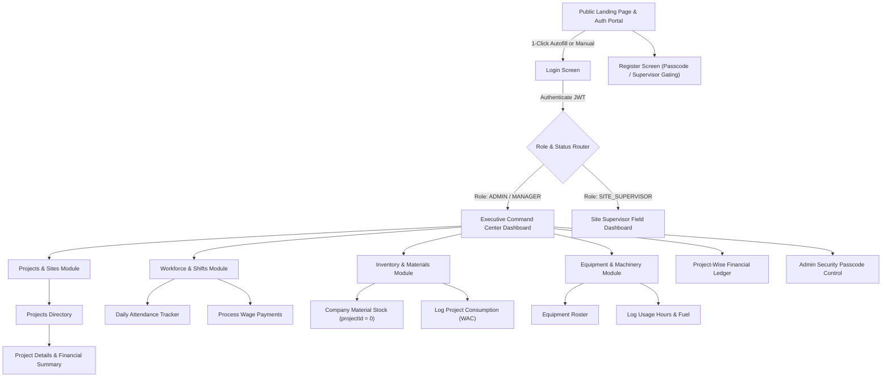
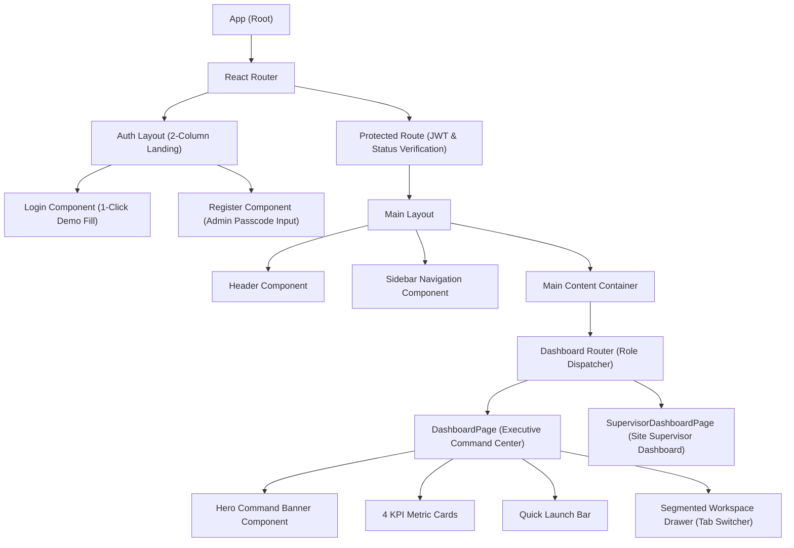

# UI Flow Document

This document outlines the user interface design, navigation flows, and component hierarchy for the React.js frontend of the BuildFlow platform.

---

## Navigation Flow & User Journey

---

## Screen List & Key Interfaces

1. **Public Landing Showcase & Auth Portal (`AuthLayout.tsx` & `LoginPage.tsx`)**
   - **2-Column Split Layout:** Left side displays platform capabilities (Active Site Operations, Workforce & Attendance, Fleet & Inventory Control, Project Financial Ledger).
   - **Quick Demo Account Autofill:** 1-Click buttons to instantly populate credentials for `Admin` (`admin` / `admin123`) or `Supervisor` (`katam` / `katam123`).
   - **Register Screen (`RegisterPage.tsx`):** Conditional Company Admin Access Passcode (`BF-ADMIN-2026`) input for Admin/Executive roles, and `PENDING_APPROVAL` status gating notice for Supervisors.

2. **Executive Command Center Dashboard (`DashboardPage.tsx`)**
   - **Hero Command Banner:** Live stat badges for Active Sites, Approved Supervisors, Workforce Crew, and Fleet Units.
   - **4 Interactive KPI Summary Cards:**
     - Construction Sites (Click to toggle Projects table).
     - Field Supervisors (Click to toggle Supervisor Approval List).
     - Admins & Managers (Click to toggle Admin list & Security Passcode management card).
     - Actual Expenses (Click to toggle Project-Wise Financial Ledger).
   - **1-Row Quick Launch Bar:** Pill shortcuts linking directly to Workforce, Equipment, Inventory, and Projects.
   - **Segmented Interactive Workspace Drawer:** Tab-segmented table panel (`1. Site Supervisors List`, `2. System Admins List & Security Passcode`, `3. Construction Projects`, `4. Project-Wise Financial Ledger`) with **"✕ Collapse Drawer"** toggle.

3. **Site Supervisor Dashboard (`SupervisorDashboardPage.tsx`)**
   - Mobile-responsive launchpad scoped specifically for site supervisors to mark daily attendance, log material consumption, and view active assigned projects.

4. **Project Management Screens (`ProjectsPage.tsx` & `ProjectDetailsPage.tsx`)**
   - Project directory with status badges (`PLANNED`, `ACTIVE`, `COMPLETED`, `CANCELLED`).
   - Financial ledger comparison (Estimated Budget vs Actual Costs, Amount Paid, Outstanding, Remaining Budget, Budget Used %).

5. **Workforce Screens (`WorkforcePage.tsx`)**
   - Labourer registry (Daily Wage, Fixed Work Agreement, Monthly Staff).
   - Attendance logging grid and partial/full wage payment processing.

6. **Inventory Screens (`InventoryPage.tsx`)**
   - Company stock catalog (`projectId = 0`).
   - Inward purchases and Weighted Average Costing (WAC) project consumption.

7. **Equipment Screens (`EquipmentPage.tsx`)**
   - Fleet roster (`AVAILABLE`, `IN_USE`, `UNDER_MAINTENANCE`).
   - Usage logging (`HOURLY` vs `DAILY` rates) and fuel logging.

8. **Finance Screens (`FinancePage.tsx`)**
   - Project financial ledger breakdown and consolidated expense tracker.

---

## Component Hierarchy

