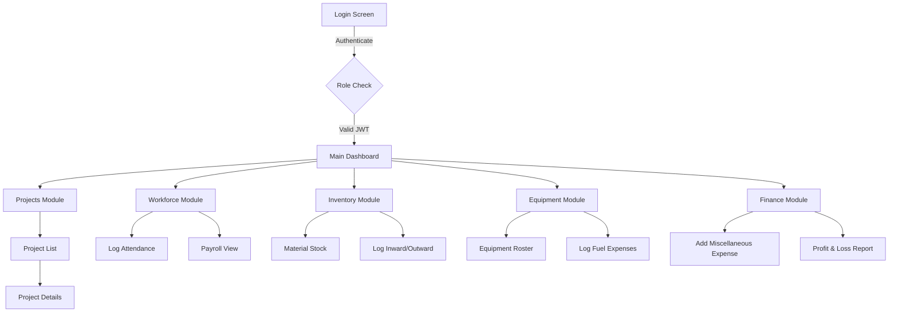
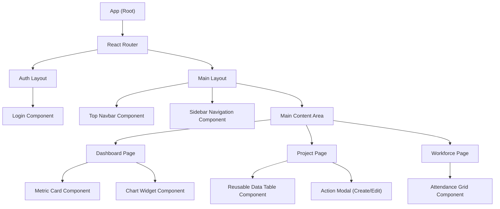

# UI Flow Document

This document outlines the user interface design, navigation flows, and component hierarchy for the React.js frontend of the BuildFlow platform.

---

## Navigation Flow
The navigation flow illustrates how users move between different modules within the application.

---

## Screen List
The application consists of the following primary screens:

1. **Auth Screens**
   - **Login Screen:** User authentication (username/password).
   - **Forgot Password Screen:** Password recovery flow.

2. **Dashboard Screens**
   - **Admin Dashboard:** High-level analytics across all projects.
   - **Manager Dashboard:** Focused analytics for assigned projects.

3. **Project Management Screens**
   - **Project List:** Table/Grid view of all projects.
   - **Project Detail:** Budget tracking, timelines, and status updates.
   - **Create/Edit Project Modal:** Form for project configuration.

4. **Workforce Screens**
   - **Labourer Registry:** List of all registered labourers and their skills.
   - **Daily Attendance Tracker:** Grid to mark Present/Absent/Half-Day.

5. **Inventory Screens**
   - **Stock Catalog:** Current quantities of all materials.
   - **Material Transaction:** Form to log inward (purchases) and outward (consumption) stock.

6. **Equipment Screens**
   - **Equipment Registry:** List of machinery and their status.
   - **Fuel Logging Form:** Input for daily fuel consumption per machine.

7. **Finance Screens**
   - **Expense Tracker:** Form to manually input miscellaneous costs.
   - **Consolidated P&L Report:** Analytics view comparing budget vs actuals.

---

## Dashboard Layout
The Main Dashboard is built using a responsive grid layout containing several critical widgets:

1. **Top Navigation Bar:** Contains the Global Search, Notification Bell (for low stock alerts), and User Profile Dropdown (Logout).
2. **Left Sidebar:** Vertical menu for navigating between the core modules (Projects, Workforce, Inventory, Equipment, Finance).
3. **Key Metric Cards (Top Row):**
   - Active Projects Count
   - Total Labourers on Site Today
   - Total Expense (Month to Date)
4. **Charts & Graphs (Middle Row):**
   - **Budget vs. Actual:** Bar chart comparing estimated project budgets against aggregated expenses.
   - **Material Consumption:** Line chart showing material usage over the last 7 days.
5. **Alerts Panel (Bottom/Side):**
   - Real-time warnings (e.g., "Cement stock below 50 bags", "Excavator due for maintenance").

---

## User Journey
**Scenario:** A Project Manager wants to check daily attendance and log a new material delivery.

1. **Step 1 (Authentication):** The user navigates to the web portal and enters their credentials on the **Login Screen**.
2. **Step 2 (Landing):** Upon successful login, they are redirected to the **Main Dashboard** where they see an overview of their assigned projects.
3. **Step 3 (View Project):** They click on "Downtown Highrise" in the Active Projects widget, navigating to the **Project Detail** screen.
4. **Step 4 (Check Attendance):** They click the "Workforce" tab within the project to view the **Daily Attendance Tracker** to ensure all expected labourers are present.
5. **Step 5 (Log Material):** They click on the "Inventory" module in the Left Sidebar, select **Material Transaction**, choose "Inward", select "Cement", enter 100 bags, and click **Submit**.
6. **Step 6 (Confirmation):** A toast notification appears confirming the transaction, and the user navigates back to the Dashboard.

---

## Component Hierarchy
The React frontend is architected using reusable, modular components.

