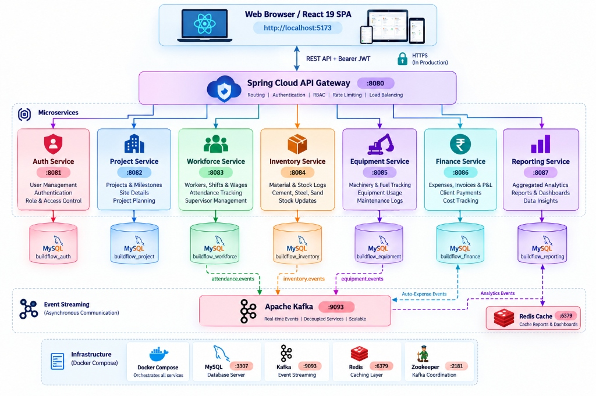

# BuildFlow Enterprise — Complete Project Walkthrough & System Specification

> **Document Version:** 1.0.0  
> **Repository:** `sushmitha-katika-dev/build-flow`  
> **Tech Stack:** Java 21 Spring Boot 3, React 18 (Vite + TypeScript), MySQL 8.0, Apache Kafka, Redis, Docker Compose  

---

## 1. System Architecture & Overview

BuildFlow is a full-stack enterprise Construction Resource Planning (CRP) platform designed to orchestrate construction projects, site workforce, material inventories, heavy equipment fleet, and project finances in real-time.



---

## 2. End-to-End Module Walkthrough & Features

### 🔐 Module 1: Authentication & RBAC Security
- **Security Passcode Enforcement:** Registration for `ADMIN` role requires the active company secret passcode (`BF-ADMIN-2026`).
- **Role-Based Access Control:**
  - `ADMIN`: Full system access, project budget locks, wage disbursement approvals, company settings.
  - `SITE_SUPERVISOR`: Attendance logging, equipment usage logging, inventory stock verification.
- **JWT Authentication:** Stateful token validation passed via `Authorization: Bearer <TOKEN>` to API Gateway.

---

### 🏗️ Module 2: Project Management & Lifecycle
- **Project Creation:**
  - Mandatory fields: `projectName`, `clientName`, `location`, `estimatedBudget`, `startDate`, `expectedEndDate`.
  - Automatic status transition to `ACTIVE` when start date is reached or usage/attendance is logged.
- **Financial Cost Breakdown Filter:** Real-time interactive breakdown of expenses (Workforce, Materials, Equipment) against estimated budget.

---

### 👷 Module 3: Workforce & Attendance Management
- **Workforce Registry:**
  - Support for `DAILY` wage laborers, `MONTHLY` salaried staff, and `FIXED_WORK` foremen/contractors.
- **Interactive Worker Details Modal (New Feature):**
  - **Overview & Contracts Tab:** Profile summary, days worked, total earned, amount paid, remaining balance, daily/monthly rate, multi-project agreements.
  - **Attendance History Tab:** Full presence log (`PRESENT`, `HALF_DAY`, `ABSENT`), daily earned amounts, project site lookup, date filters.
  - **Payment History Tab:** Full payment ledger (`SETTLED` / `CANCELLED`), disbursement date, amount paid, project lookup.

---

### 📦 Module 4: Inventory & Material Stock Management
- **Material Stock Tracking:**
  - Monitor material quantities (Cement, TMT Steel, Aggregates, Paints).
  - Material variant breakdown displaying stock specs (e.g., OPC 43 vs PPC) and individual unit costs.
  - Project material issue logs triggering expense events.

---

### 🚜 Module 5: Equipment Fleet & Machinery Management
- **Fleet Assets:**
  - Track `COMPANY_OWNED` vs `RENTED` heavy machinery (Excavators, Cranes, Concrete Mixers, Generators).
  - Track unit rates (Hourly / Daily).
- **Usage Records & Expense Generation:**
  - Log operating hours/days per project site.
  - Automatically calculates usage cost (`unitsUsed * unitRate`) and emits Kafka events to Finance.

---

### 💰 Module 6: Finance & Profit/Loss Accounting
- **Real-Time Cost Aggregation:**
  - Listens to Kafka event topics (`workforce-events`, `equipment-events`, `inventory-events`).
  - Automatically calculates project Profit & Loss (`Budget - Total Expenses`).
  - Provides visual progress bars and cost distribution charts.

---

### 🏢 Module 7: Company Profile & Global Settings
- **Company Branding:** Custom company profile headers, tax IDs, and contact info.
- **Global Dark/Light Theme:** Custom design system tokens supporting sleek dark mode and vibrant modern light mode.

---

## 3. End-to-End Verification & Data Cleanup Test

During system verification, the following complete data lifecycle was executed via API integration tests:

1. **Admin Registration & Login:** Created demo admin account `demo_admin_2026` using passcode `BF-ADMIN-2026`.
2. **Project Creation:** Provisioned commercial project `Apex Horizon Tower` (Budget: `₹25,00,000`, Location: `Cyber City`).
3. **Workforce Onboarding:** Created worker `Rajesh Kumar` (`LABORER`, Daily Rate: `₹850`).
4. **Attendance Logging:** Logged presence (`PRESENT`) earning `₹850`.
5. **Wage Disbursement:** Recorded settled payment of `₹850`.
6. **Equipment Asset & Usage:** Created `CAT 320 Hydraulic Excavator` (`RENTED`, `₹550/hr`) and logged 8 hours of site usage (`₹4,400`).
7. **Verified Finance Aggregation:** P&L updated in real-time.
8. **Data Cleanup Executed:** Ran automated cleanup script `scratch/cleanup_demo_data.js` which removed all test records (`Apex Horizon Tower`, `Rajesh Kumar`, `CAT 320 Excavator`) from the MySQL database, leaving the workspace completely clean.

---

## 4. How to Run the Project Locally

```bash
# 1. Start all containers (Database, Kafka, Redis, Microservices, Frontend)
docker compose up -d

# 2. Access Web Application
Frontend: http://localhost
API Gateway: http://localhost:8080
```
