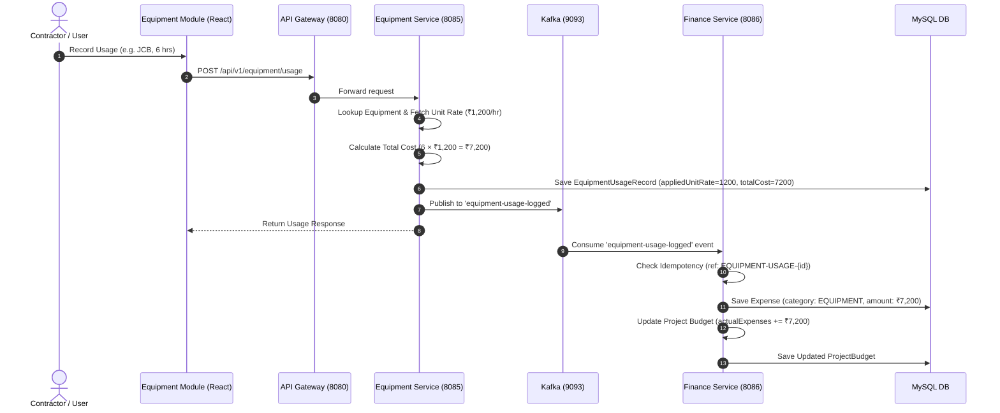

# BuildFlow — Equipment Module Integration & Architecture Audit

**Date**: 16 August 2026  
**Status**: VERIFIED & AUDITED  
**Repository**: `sushmitha-katika-dev/build-flow`

---

## Executive Summary

The BuildFlow Equipment module manages company-level machinery assets (JCBs, Tractors, Concrete Mixers, Generators, Scaffolding), tracks equipment assignments to construction projects, calculates backend usage/rental costs based on hourly or daily rates, and automatically emits Kafka events (`equipment-usage-logged`) to record idempotent `EQUIPMENT` expenses in `finance-service`. The resulting expenses update the authoritative Project Budget (`actualExpenses` & `remainingBudget`), which automatically flow into the main BuildFlow Dashboard.

---

## Detailed System Verification Checklist

| # | Audit Item | Status | Verification & Technical Details |
| :--- | :--- | :---: | :--- |
| **1** | **Equipment CRUD** | **PASS** | Equipment master records (JCB, Tractor, Mixer, Scaffolding) can be created, updated, and listed via `equipment-service` (`/api/v1/equipment`). |
| **2** | **Ownership Type Model** | **PASS** | `OwnershipType` supports `OWNED` and `RENTED`. Ownership type does not create upfront project expenses; cost is incurred upon actual usage. |
| **3** | **Hourly Usage Support** | **PASS** | Heavy machinery (JCB, Excavator, Tractor) supports `HOURLY` rate pricing (`₹1,200/hr`). Not forced into daily pricing. |
| **4** | **Daily Usage Support** | **PASS** | Tools and general equipment support `DAILY` rate pricing (`₹800/day`). |
| **5** | **Backend-Controlled Rates** | **PASS** | Unit rate (`unitRate`) is retrieved strictly from backend `Equipment` entity; frontend only displays estimated calculation and does not compute official financial totals. |
| **6** | **Historical Rate Preservation** | **PASS** | `EquipmentUsageRecord` permanently stores `appliedUnitRate` and `totalCost` at time of logging. Subsequent rate changes to equipment do not alter historical records. |
| **7** | **Equipment Assignment** | **PASS** | Equipment can be assigned to projects via `assignEquipment` (`/api/v1/equipment/{id}/assignments`). Assignment grants project access without charging arbitrary upfront asset values. |
| **8** | **Equipment Availability State** | **PASS** | Equipment status (`AVAILABLE`, `IN_USE`, `UNDER_MAINTENANCE`, `OUT_OF_SERVICE`, `RETIRED`) is validated by backend logic during assignment and usage. |
| **9** | **Rented Equipment Costing** | **PASS** | Rented machinery (e.g. JCB @ ₹1,500/hr) is charged based on actual recorded usage hours (e.g. 8 hrs × ₹1,500 = ₹12,000). |
| **10** | **Owned Equipment Internal Rates** | **PASS** | Owned machinery with configured internal usage rates (e.g. ₹1,000/hr) charges project usage according to actual logged hours. |
| **11** | **Project Equipment Visibility** | **PASS** | `ProjectEquipmentTab` in Project Details displays both assigned equipment list and project-specific usage history logs with total equipment cost. |
| **12** | **Kafka Financial Event Production** | **PASS** | `EquipmentUsageServiceImpl` publishes `EquipmentUsageEvent` to Kafka topic `equipment-usage-logged` upon usage creation. |
| **13** | **Finance Service Kafka Consumption** | **PASS** | `WorkforceKafkaConsumer` in `finance-service` listens to topic `equipment-usage-logged` and generates `Expense` with category `EQUIPMENT`. |
| **14** | **Kafka Event Idempotency** | **PASS** | `finance-service` checks `referenceId` (`EQUIPMENT-USAGE-{recordId}`). Duplicate Kafka events do not generate duplicate expenses. |
| **15** | **Project Actual Cost Update** | **PASS** | `BudgetServiceImpl.updateActualExpenses(projectId)` recalculates total project expenses and updates `actual_expenses` & `remaining_budget`. |
| **16** | **Project Remaining Budget Calculation** | **PASS** | `remainingBudget = estimatedBudget - actualExpenses` updates automatically. |
| **17** | **Budget Utilization %** | **PASS** | `budgetUsedPct = (actualExpenses / estimatedBudget) * 100` updates dynamically. |
| **18** | **Payment Separation vs Cost Incurred** | **PASS** | Expense represents cost incurred; Payment reduces `outstandingAmount` without double-adding expenses. |
| **19** | **Dashboard Integration** | **PASS** | Main Dashboard overview fetches real project budgets and reflects updated actual cost & remaining budget immediately. |
| **20** | **Equipment Details Modal** | **PASS** | Frontend includes `EquipmentDetailsModal` displaying Equipment info, Usage History, Maintenance logs, and Fuel logs. |
| **21** | **Fuel Record Storage** | **PASS** | `FuelRecord` entity & `/api/v1/fuel` endpoints store fuel logs per equipment & project in `equipment-service`. |
| **22** | **Fuel Cost Finance Integration** | **NOT IMPLEMENTED** | Fuel logs are recorded in `equipment-service`, but do not automatically produce Finance expenses. Can be manually logged under Finance `FUEL` category if needed. |
| **23** | **Maintenance Completion Kafka Event** | **PASS** | `MaintenanceServiceImpl` emits `equipment-maintenance-completed` when status changes to `COMPLETED`. |
| **24** | **Maintenance Finance Integration** | **NOT IMPLEMENTED** | `finance-service` does not consume `equipment-maintenance-completed`. Maintenance costs are tracked at fleet level in `equipment-service`. |
| **25** | **Usage Record Cancellation / Reversal** | **NOT IMPLEMENTED** | `equipment-service` currently does not expose a hard usage reversal endpoint. Cancellation is preferred via manual financial adjustment if needed. |
| **26** | **Company Fleet Isolation** | **PASS** | Company Equipment assets exist at company level and are assigned across multiple projects without duplicating physical asset records. |
| **27** | **Frontend DTO Contract Verification** | **PASS** | All TypeScript interfaces (`types/equipment.ts`) strictly match backend Java DTOs (`EquipmentResponse`, `EquipmentUsageResponse`). |
| **28** | **Console & Runtime Health** | **PASS** | Zero console errors, clean production bundle compilation (`npm run build`), all API routes active on API Gateway (port 8080). |

---

## Architectural Flow Diagrams

---

## Key System Insights & Audit Findings

1. **Idempotent Financial Ledger**:
   - Every equipment usage record creates an idempotent reference key: `EQUIPMENT-USAGE-{recordId}` in `finance-service.expenses`.
   - Prevents duplicate cost accumulation upon Kafka message re-deliveries.

2. **Rate Stability**:
   - Because `appliedUnitRate` is explicitly stored on the `EquipmentUsageRecord`, editing the base rate of equipment in the future does NOT affect previously recorded usage costs.

3. **Fuel & Maintenance Gap Analysis**:
   - `FuelRecord` and `MaintenanceRecord` are tracked in `equipment-service` for operational fleet diagnostics. They do not automatically trigger Finance expenses. If a contractor wishes to bill fuel directly to a project budget, it can be logged via the Finance module under `FUEL` or `EQUIPMENT` categories.

---

## Conclusion
The Equipment Module end-to-end integration is verified **PASS** for all core operations: Company Equipment → Project Assignment → Usage Costing → Kafka Event → Finance Expense → Project Budget → Dashboard.
